# MediLine Project

## Overview
MediLine is a comprehensive web application designed to streamline the process of booking and managing doctor consultations and diagnostic appointments. The platform also allows users to upload and manage their medical reports, ensuring that all medical records are easily accessible in one place. Additionally, the application includes a dedicated interface for doctors, enabling them to efficiently manage their appointments and patient information.

## Features

### User End (Patients)
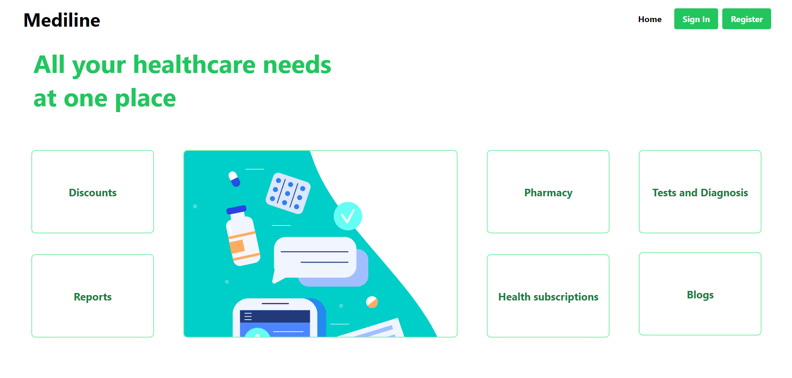
- 
- **Appointment Booking**: Users can search for doctors or diagnostic services and book appointments based on availability.
- 
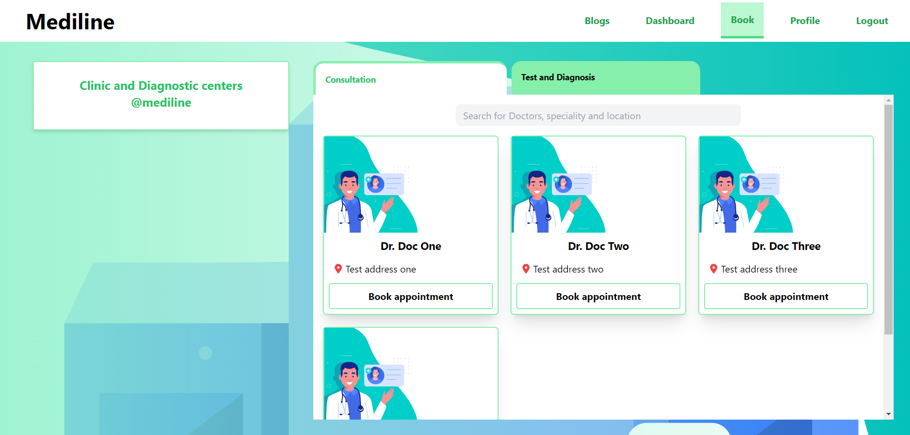
- 
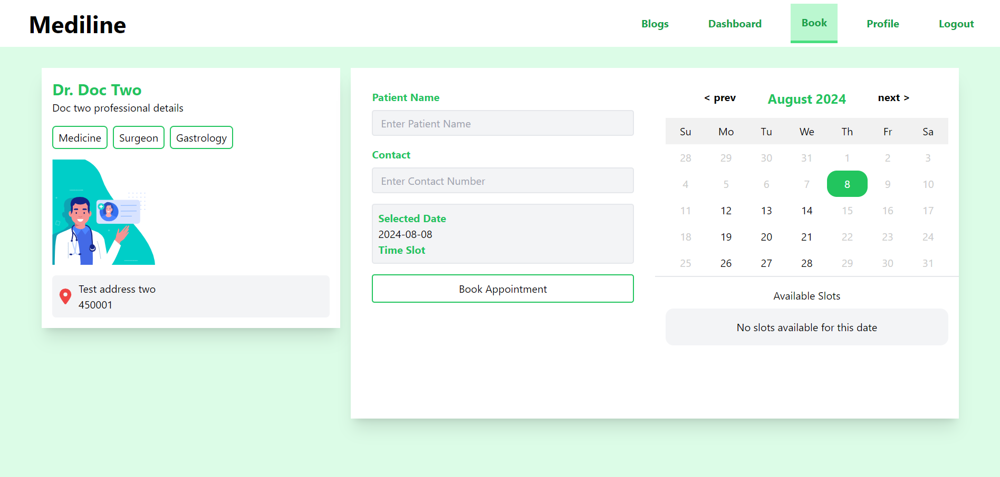
- 
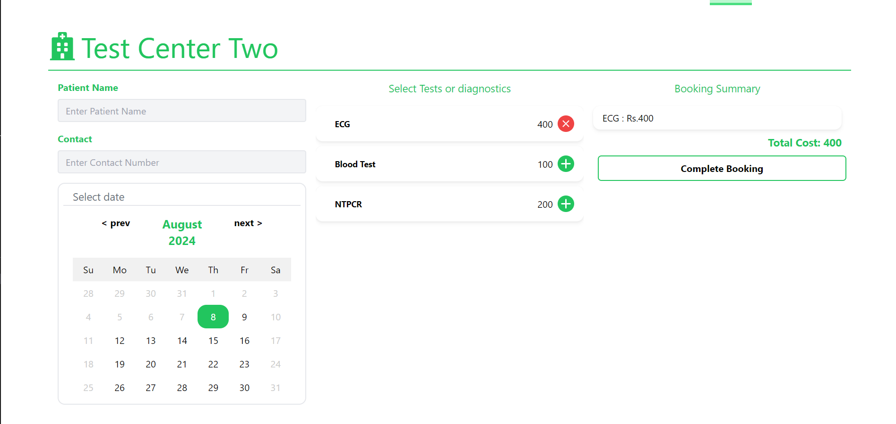

- **Appointment Management**: View, reschedule, or cancel upcoming appointments with ease.
- 
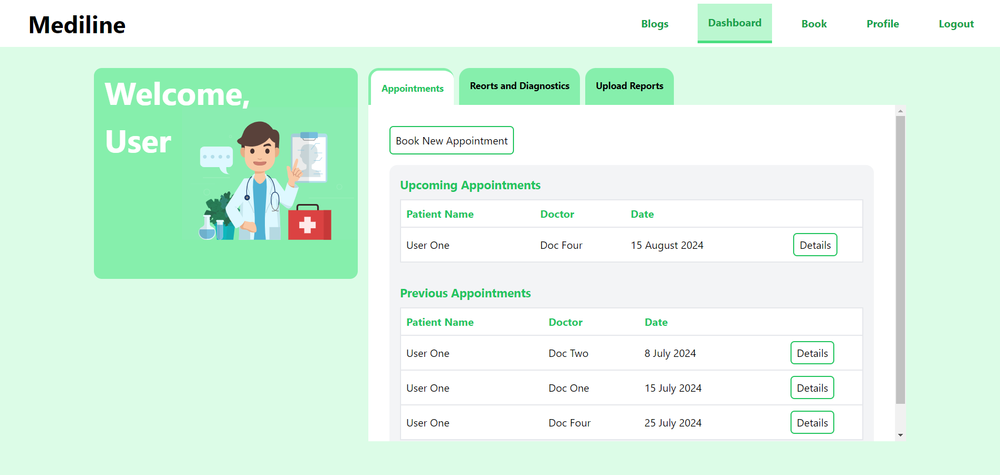
- 
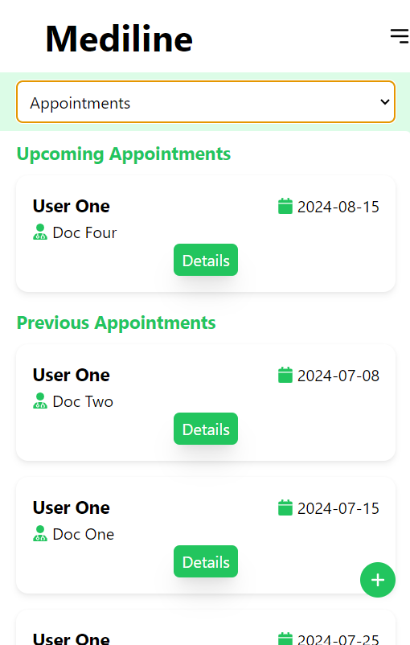

- **Medical Report Management**: Upload, view, and manage your medical reports securely.
- 
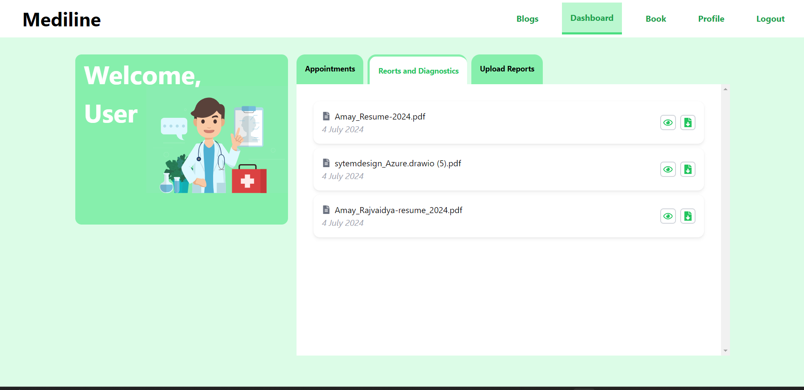
- **User Profile Management**: Update personal information, contact details, and preferred doctors or services.
- **Mediline Blogs**: Healthcare blogs for readers to get aware in healcare management.
- 
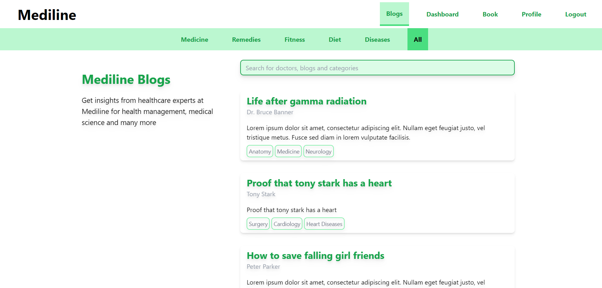
- 
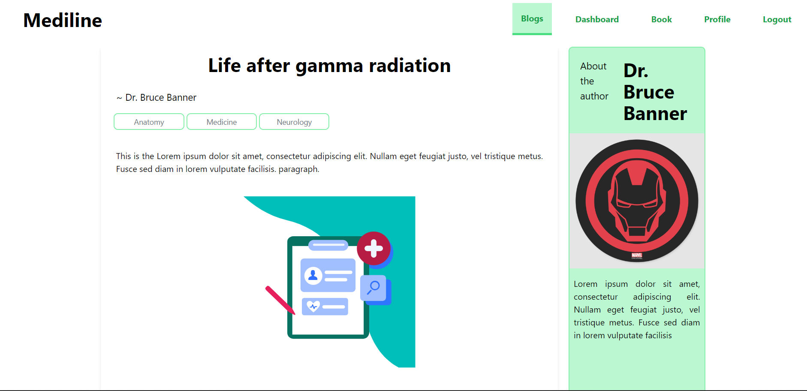
- 
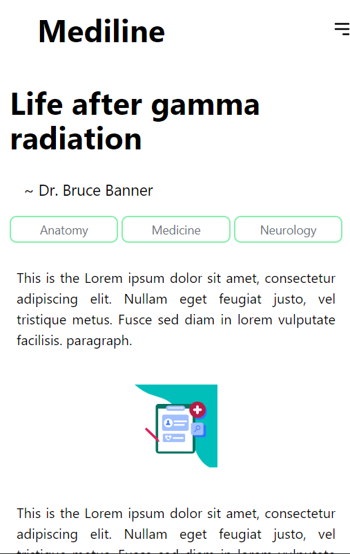

### Doctor Office End
- **Patient Management**: Access patient profiles, view medical history, and manage treatment notes.

- **Doctor dashboard**: A comprehensive interface to check daily, weekly, and monthly appointments.
- 
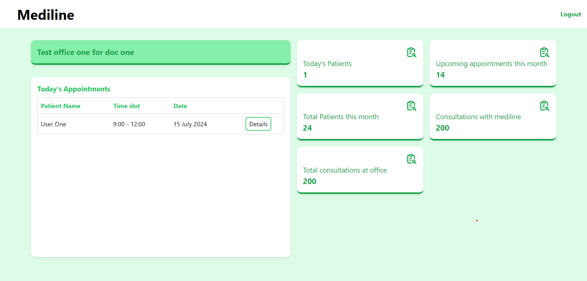
## Technology Stack

### Frontend
- **React.js**: A powerful JavaScript library for building user interfaces, ensuring a responsive and dynamic user experience.
- **React Router**: Handles routing and navigation between different views within the application.
- **Axios**: For making HTTP requests from the frontend to the backend API.

### Backend
- **Node.js**: A JavaScript runtime built on Chrome's V8 engine, used for building the server-side logic.
- **Express.js**: A web application framework for Node.js, handling routing, middleware, and HTTP requests.
- **MongoDB**: A NoSQL database used for storing user data, appointments, and medical reports securely.
- **JWT**: JSON Web Tokens are used for secure authentication and session management.

## Setup and Installation

### Prerequisites
- **Node.js**: Ensure you have Node.js installed. You can download it from [Node.js official website](https://nodejs.org/).
- **MongoDB**: A running instance of MongoDB for the database. You can use MongoDB Atlas or run a local instance.

